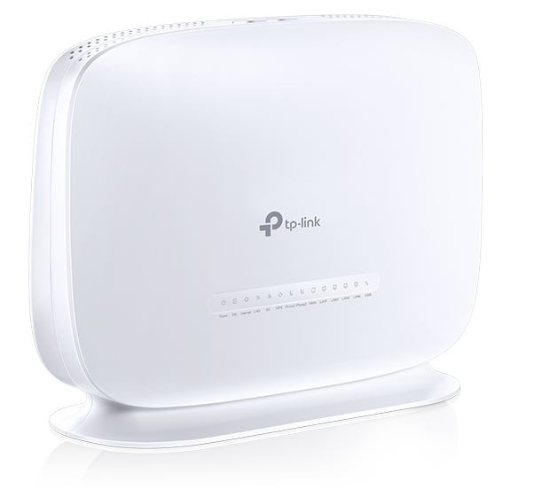

# tp-link-archer
TP-Link VR1600v2 / AC1600 router reversing

TP-Link VR1600v2 / AC1600 router reversing

The [TP-Link VR1600](https://www.tp-link.com/au/service-provider/xdsl/archer-vr1600v/) router received from my ISP TPG Australia is particularly locked down. An earlier model / software image used to have a hidden super user account `sa` which let people modify the system settings not available to the `admin` account provided to the end customer. This account / password no longer works. Given that TPG can remotely access and update the router, and given services that are exposed on the Internet, there is good motivation to reclaim and take ownership of the device. 

TLDR; the `sa` account has been removed from the configuration file in the image (although the password is still provisioned). It is possible with a little effort to gain a root shell on the router to make modifications. TP-Link has deliberately disconnected these pins from the Broadcom chip by removing two resistors which need to be ‘replaced’. 

On the board there is the possibility to connect to the serial / UART of the Broadcom SoC the following is the view from the underneath the board. I had already soldered a header on, normally these would be unpopulated.

From the perspective from the top of the board, the pins are as followed for J5, the UART connection:

- 3.3v (do not connect)
- GND (ground)
- RX (connect to TX of the serial device)
- TX (connect to RX of the serial device)

Two surface mount resistors are observed to be missing, R283 and R279. These need to be replaced. I used a 1k resistor for each. It might also be possible to bridge the connection with solder, but at this stage I did not want to open the possibility to brick the device. That said, it would be much easier then soldering on these tiny things:

Withe header and resistors added, we are now ready to rock.

Here I opted to use the bus pirate

 interface. From there it is possible to dump the flash contents (abit slowly). I took this route initially in order to find the initial credentials which happened to be stored in plain-text in flash. Here [CFE-Dump](https://github.com/Depau/bcm-cfedump) did the trick with the following:
`python -m bcm_cfedump -D /dev/ttyUSB0 -O nand.img  nand`

Binwalk can then be used to recursively extract the file system, although it has troubles with the JFFS2 partitions. 

