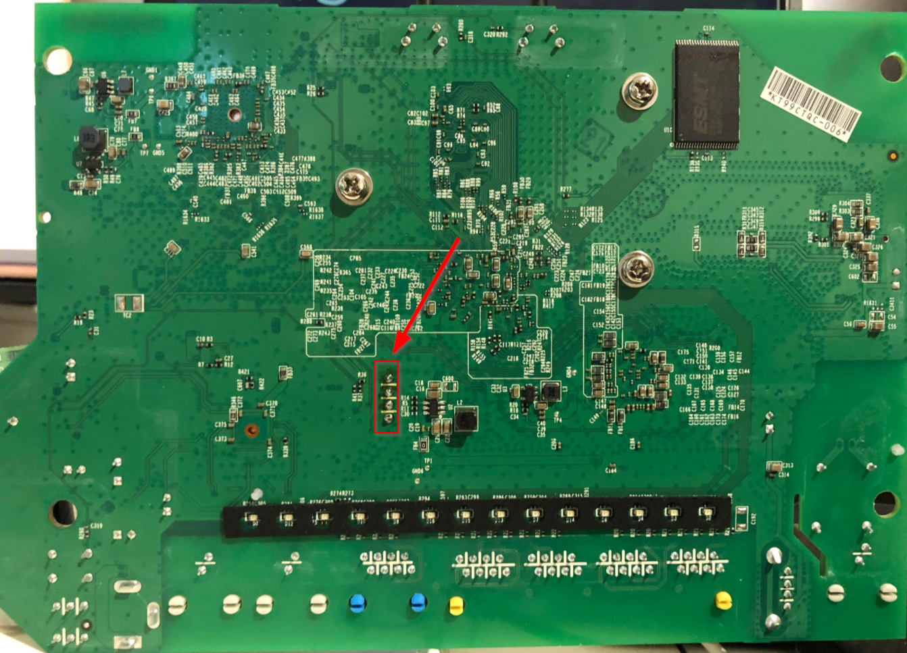
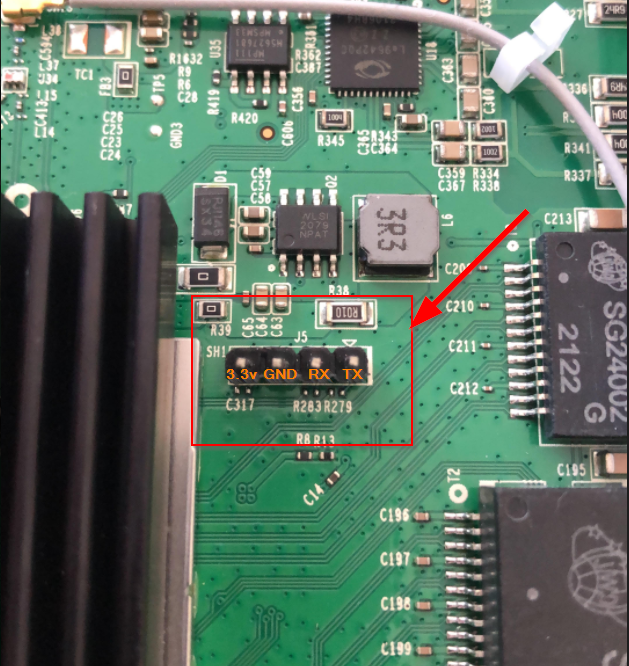
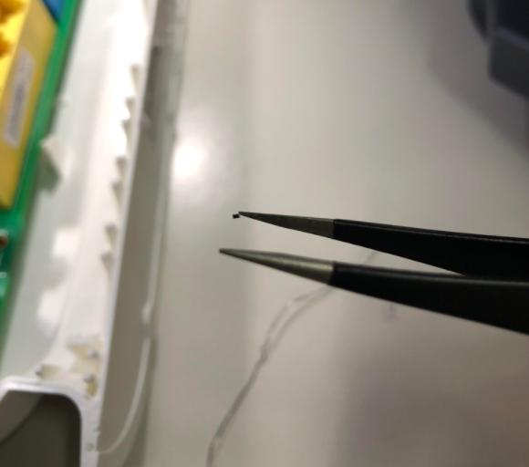
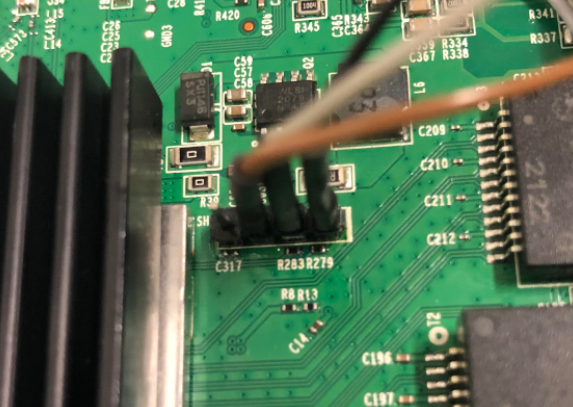
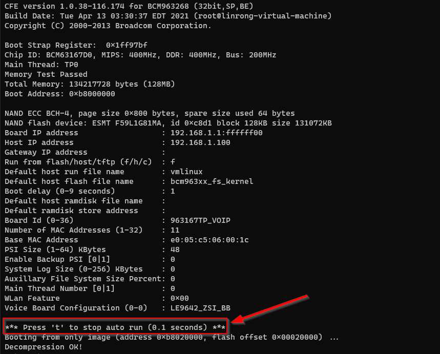
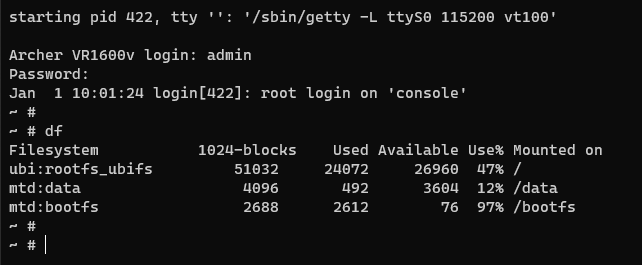

# tp-link-archer
TP-Link VR1600v2 / AC1600 router reversing

# Accessing the UART port

The [TP-Link VR1600](https://www.tp-link.com/au/service-provider/xdsl/archer-vr1600v/) router received from my ISP TPG Australia is particularly locked down. An earlier model / software image used to have a hidden super user account `sa` which let people modify the system settings not available to the `admin` account provided to the end customer. This account / password no longer works. Given that TPG can remotely access and update the router, and given services that are exposed on the Internet, there is good motivation to reclaim and take ownership of the device. 

TLDR; the `sa` account has been removed from the configuration file in the image (although the password is still provisioned). It is possible with a little effort to gain a root shell on the router to make modifications. TP-Link has deliberately disconnected these pins from the Broadcom chip by removing two resistors which need to be ‘replaced’. 

On the board there is the possibility to connect to the serial / UART of the Broadcom SoC the following is the view from the underneath the board. I had already soldered a header on, normally these would be unpopulated.



From the perspective from the top of the board, the pins are as followed for J5, the UART connection:

- 3.3v (do not connect)
- GND (ground)
- RX (connect to TX of the serial device)
- TX (connect to RX of the serial device)



Two surface mount resistors are observed to be missing, R283 and R279. These need to be replaced. I used a 1k resistor for each. It might also be possible to bridge the connection with solder, but at this stage I did not want to open the possibility to brick the device. That said, it would be much easier then soldering on these tiny things:



Withe header and resistors added, we are now ready to rock.



Serial connection parameters are:

- 115200 baud
- Parity none
- Databits 8
- Stop bits 1 

On powering the device, we have the choice to jump into a menu item that will allow us to dump / erase / write to the flash by interupting the boot sequence, or we can let it run through to the login prompt.



The login credentials are `admin` / `1234`.



## Dumping flash

By hitting the `t` key repetitively we can gain access to the [CFE](https://en.wikipedia.org/wiki/Common_Firmware_Environment) interface. From there it is possible to dump the flash contents (abit slowly). I took this route initially in order to find the initial credentials which happened to be stored in plain-text in flash. Here [CFE-Dump](https://github.com/Depau/bcm-cfedump) did the trick with the following:

`python -m bcm_cfedump -D /dev/ttyUSB0 -O nand.img  nand`

Note, the vanilla binwalk installation from apt/yum won't cut it as there are additional dependencies required which can be installed from the [binwalk repo](https://github.com/ReFirmLabs/binwalk/wiki/Quick-Start-Guide) by running `./binwalk-master/deps.sh`

```
# binwalk nand.img

DECIMAL       HEXADECIMAL     DESCRIPTION
--------------------------------------------------------------------------------
131072        0x20000         JFFS2 filesystem, big endian
2883584       0x2C0000        UBI erase count header, version: 1, EC: 0x1, VID header offset: 0x800, data offset: 0x1000
129892352     0x7BE0000       JFFS2 filesystem, big endian
```

Binwalk can then be used to recursively extract the file system, although it has troubles with the JFFS2 partitions. I suspect this was due to an issue in the 3rd party lib that binwalk uses to extract. 

This did the job:
```
apt-get install mtd-utils
jffs2dump -b -c -r -e 20000.jffs2.le 20000.jffs2
modprobe jffs2
mtdram
mtdchar
mtdblock
dd if=20000.jffs2.le of=/dev/mtdblock0
mkdir /mnt/20000.jffs2/
mount -t jffs2 /dev/mtdblock0 /mnt/20000.jffs2
```
Note: there isn't really that much to see here. the JFFS2 volume  mounts to /data which is used to store the working config files changes. 
## What happened to the sa user ?

It appears to be removed from the configuration (`<AdminName>`). Interesting enough the password is still there. While the base image config file is encrypted, the active config in the flash /data/config. It is encrypted   
```
    <X_TP_UserCfg>
      <AdminPwd val=VExy!64a3ng />
      <UserName val=admin />
      <UserPwd val=admin/>
    </X_TP_UserCfg>
```

We can verify this by inspecting `/etc/reduced_data_model_decrypted.xml` which is a specification / schema for the TP-Link config file format:
```
               <X_TP_UserCfg t=o r=P s=USER_CFG_OBJ h=1>
			...
                        <AdminName t=s r=W l=16 al=cli h=1 />
                        <AdminPwd t=s r=W l=16 al=cli h=1 />
                        <UserName t=s r=W l=16 al=cli h=1 />
                        <UserPwd t=s r=W l=16 al=cli h=1 />
			...
```
Decrypting these XML files can be achieved with the following:
```
openssl enc -d -des-ecb -nopad -K 488CB50BE9F3A2CF -in default_config.xml -out default_config_decrypted.xml
```
Note this method is also documented [here](https://github.com/sta-c0000/tpconf_bin_xml), although the DES key is different. Interesting enough, you can use `tpconf_bin_xml.py` from that repo to also decrypt `/mnt/MFG_conf.bin` The DES key in this script is for the Archer Cx series which leads me to believe MFG_conf.bin is a remnant from a previous image / version.

Spinning up [Ghidra](https://ghidra-sre.org/) the key is `488CB50BE9F3A2CF` is found:

```
The DES key has been changed in this model. It is found in:

` [ dm_readFile ] 2063:  can not open xml file /var/tmp/pc/reduced_data_model.xml!, about to open file /etc/reduced_data_model.xml`

